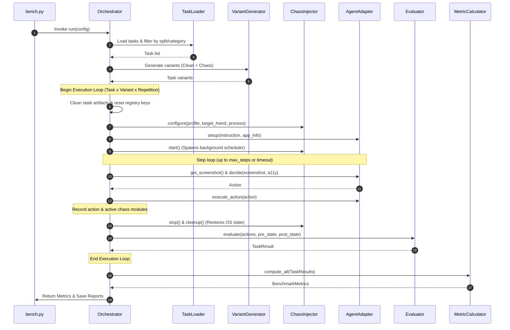

# DesktopAgentBench — System Architecture & Implementation Explanation

This document provides a comprehensive, deep-dive explanation of **DesktopAgentBench**, detailing its design philosophy, architectural components, execution lifecycle control loops, and metrics computation logic. It is intended to help developers, researchers, and maintainers understand how the benchmark operates under the hood.

---

## 1. Design Philosophy

DesktopAgentBench is a Windows-only, agent-agnostic reliability benchmark designed to stress-test the resilience of desktop automation agents under safe, reversible, and parameterizable environmental disruption.

Unlike standard capabilities benchmarks (which evaluate agents in pristine, quiet desktop states), DesktopAgentBench addresses real-world, noisy production settings where:
1. Toast notifications pop up unexpectedly.
2. Background applications steal system focus.
3. Rendering lags freeze the application view.
4. Windows get accidentally resized or snapped.
5. UAC credential screens intercept inputs.

### Core Architectural Guarantees
* **Safety & Sandboxing**: All chaos windows and overlays are owned by the benchmark process; no administrative changes or destructive actions (file deletion, registry tampering) are performed.
* **Complete Reversibility**: All chaos modules implement strict `cleanup()` logic to restore original desktop geometry, registry entries, and window focus before a run terminates.
* **Agent Agnosticism**: Any agent can be evaluated by wrapping it in the standard [AgentAdapter](file:///r:/Desktop%20Agent%20Benchmark/src/agents/adapter.py) interface.

---

## 2. Overall Execution Flow

The diagram below details the data flow and orchestration sequence when running evaluations through the CLI entrypoint:

---

## 3. Core Component Breakdown

### 3.1. CLI Entrypoint
The command-line interface is implemented in [bench.py](file:///r:/Desktop%20Agent%20Benchmark/bench.py) using the `click` library. It exposes:
* `run`: Launches a benchmark session with custom options (overriding `configs/default.yaml`).
* `validate`: Verifies task definition JSON files against the strict Pydantic task schema.
* `list-tasks`: Queries and prints all available tasks in a tabular format.
* `list-agents`: Registers and displays all loaded agent adapters.
* `report`: Regenerates markdown and JSON reports from previous evaluation data directories.

> [!TIP]
> To speed up screenshot fetching during execution, [bench.py](file:///r:/Desktop%20Agent%20Benchmark/bench.py) monkey-patches `PIL.ImageGrab.grab` with a 0.5-second caching window, reducing CPU bottlenecks on rapid click sequences.

### 3.2. Orchestrator
The central pipeline controller is [Orchestrator](file:///r:/Desktop%20Agent%20Benchmark/src/core/orchestrator.py#L48). It is responsible for setting up the environment before each test and cleaning it up after.

Its setup/teardown sequence includes:
* **Artifact Cleanup**: In [_clean_task_artifacts](file:///r:/Desktop%20Agent%20Benchmark/src/core/orchestrator.py#L164), it unlinks target directories/files, flushes the Windows clipboard, kills background Task Manager instances, and resets registry keys (e.g. Dark Theme, Taskbar Animations) to prevent state leaks from prior evaluations.
* **Preconditions**: Launches necessary executables listed in the task's `preconditions.apps_required`.
* **HWND Detection**: Discovers the active target handle using the `WindowManager` so the chaos modules target only the application pane under test.
* **Teardown**: Terminates all launched processes and calls `Agent.teardown()`.

### 3.3. Chaos Engine
The chaos engine is split into three layers:
1. **The Scheduler** ([ChaosScheduler](file:///r:/Desktop%20Agent%20Benchmark/src/chaos/scheduler.py#L29)): A multi-threaded timing loop that schedules chaos injection callbacks using standard `threading.Timer` objects. It models random event distribution using a Poisson-like interval picker with configurable frequencies and jitters.
2. **The Injector** ([ChaosInjector](file:///r:/Desktop%20Agent%20Benchmark/src/chaos/injector.py#L108)): Manages loaded modules, filters them by task compatibility, forwards current target coordinates, and registers fired events.
3. **The Chaos Modules** ([src/chaos/modules/](file:///r:/Desktop%20Agent%20Benchmark/src/chaos/modules/)): Safe, visual-only disruption scripts using Win32 and PowerShell APIs.

| Module | Core Logic & API | Safety & Cleanup |
|--------|------------------|------------------|
| [PopupSpawner](file:///r:/Desktop%20Agent%20Benchmark/src/chaos/modules/popup_spawner.py) | Spawns fake system alerts using `MessageBoxTimeoutW` or `MessageBoxW` in a daemon thread. | Auto-dismisses using native OS timeouts; doesn't block main loop. |
| [FocusStealer](file:///r:/Desktop%20Agent%20Benchmark/src/chaos/modules/focus_stealer.py) | Creates a temporary `Static` topmost window using `CreateWindowExW` and pulls focus away using `SetForegroundWindow` and `FlashWindowEx`. | Re-focuses target application window and destroys the distractor window on cleanup. |
| [UIDelay](file:///r:/Desktop%20Agent%20Benchmark/src/chaos/modules/ui_delay.py) | Frozen appearance simulated by disabling window redraws using `WM_SETREDRAW` message parameters. | Re-enables window redrawing and triggers a repaint via `InvalidateRect`/`UpdateWindow`. |
| [WindowResizer](file:///r:/Desktop%20Agent%20Benchmark/src/chaos/modules/window_resizer.py) | Changes window layout, snapping coordinates, or size parameters using the Win32 `MoveWindow` API. | Automatically caches original bounding dimensions and restores them on teardown. |
| [UACFaker](file:///r:/Desktop%20Agent%20Benchmark/src/chaos/modules/uac_faker.py) | Dims screen via a 50% opacity translucent overlay and prompts a simulated elevation modal using `MessageBoxTimeoutW`. | Destroys the dimming overlay window and dismisses the MessageBox popup. |
| [NotificationSpoofer](file:///r:/Desktop%20Agent%20Benchmark/src/chaos/modules/notification_spoofer.py) | Generates native Windows Toast notifications by passing XML payloads to PowerShell's WinRT .NET namespace. | Toast cards disappear natively from the screen with no cleanup required. |
| [ScrollHider](file:///r:/Desktop%20Agent%20Benchmark/src/chaos/modules/scroll_hider.py) | Removes visual scrollbar guides from target window client regions via `ShowScrollBar` (SB_VERT/SB_HORZ/SB_BOTH). | Restores style properties and forces frame redraws using `SetWindowPos`. |

### 3.4. Evaluator & Diffing State
The [Evaluator](file:///r:/Desktop%20Agent%20Benchmark/src/core/evaluator.py#L307) runs verification logic:
* **Success Criteria Registry**: Dispatches success evaluation tasks to specialized checkers (`file_exists`, `file_content_matches`, `file_content_regex`, `app_launched`, `window_exists`, `clipboard_content`, `registry_value`).
* **Side-Effect Diffing**: Diffing `pre_state` and `post_state` logs captured by [ProcessManager](file:///r:/Desktop%20Agent%20Benchmark/src/platform/process_manager.py) and filesystem scrapers to detect unintended modifications (e.g. extra files, spawned admin cmd processes), which is key to computing latent harm.
* **Recovery Analysis**: Assesses whether the agent was actively disrupted (chaos events fired while the agent was running steps) and succeeded anyway.
* **Loop/Stuck Detection**: Marks execution as unrecoverable if the agent repeats the exact same coordinate clicks/inputs 3+ times (common visual agent loop under lag) or times out with zero progress.

### 3.5. Agent Adapters & Simulations
The benchmark supports any agent subclassing the [AgentAdapter](file:///r:/Desktop%20Agent%20Benchmark/src/agents/adapter.py#L31) base class. For testing and replication without expensive LLM backends, the codebase simulates typical agent design classes:

1. [NoopAgent](file:///r:/Desktop%20Agent%20Benchmark/src/agents/builtin/noop_agent.py): Waits 3 steps and signals completion. Provides a zero-baseline.
2. [RandomAgent](file:///r:/Desktop%20Agent%20Benchmark/src/agents/builtin/random_agent.py): Sends arbitrary mouse clicks, keystrokes, and wait inputs to establish a floor.
3. [RuleAgent](file:///r:/Desktop%20Agent%20Benchmark/src/agents/builtin/rule_agent.py): Executes hardcoded keystroke/mouse actions for specific tasks. Equipped with a focus recovery policy (clicking targets and pressing Alt to unlock foreground locks).
4. [UFOAgent](file:///r:/Desktop%20Agent%20Benchmark/src/agents/builtin/ufo_agent.py): Emulates Microsoft's UIA-based focus-aware agent. In its setup, it actively tracks the window focus and dismisses modal popups/coordinates layout shifts using UIA queries.
5. [ClaudeAgent](file:///r:/Desktop%20Agent%20Benchmark/src/agents/builtin/claude_agent.py): Emulates Anthropic's Claude Computer Use framework. It relies on absolute coordinate coordinates and lacks focus monitoring, making it prone to clicking distractor windows under focus steals (causing latent harm) or getting stuck in action loops under UI delay.
6. [OmniParserAgent](file:///r:/Desktop%20Agent%20Benchmark/src/agents/builtin/omniparser_agent.py): Emulates visual segment parser agents. Tolerant of resizing because it parses visual boundaries dynamically, but fails when focus shifts to background tasks since it only parses the visual bitmap.

---

## 4. Metrics Reference

The metrics calculation engine is defined in [calculator.py](file:///r:/Desktop%20Agent%20Benchmark/src/metrics/calculator.py#L53). It aggregates runs across repetitions and computes the following 7 core metrics:

### 4.1. Task Success Rate (TSR) ↑
Percentage of successful runs (all success criteria met).
$$\text{TSR} = \frac{\sum_{r=1}^N \mathbb{1}[\text{Success}(r)]}{N}$$

### 4.2. Robustness Score (RS) ↑
Performance stability ratio under chaos relative to clean baseline.
$$\text{RS} = \frac{\text{TSR}_{\text{chaos}}}{\text{TSR}_{\text{clean}}}$$

### 4.3. Recovery Rate (RR) ↑
Resilience score showing the fraction of disrupted runs that succeeded.
$$\text{RR} = \frac{\sum_{r \in R_{\text{disrupted}}} \mathbb{1}[\text{Success}(r)]}{|R_{\text{disrupted}}|}$$

### 4.4. Unrecoverable Action Rate (UAR) ↓
Proportion of stuck action loops, crashes, or timeout runs.
$$\text{UAR} = \frac{\sum_{r=1}^N \mathbb{1}[\text{Stuck/Crashed}(r)]}{N}$$

### 4.5. Human Assistance Rate (HAR) ↓
Rate of explicit help prompts or timeout stalls with zero progress.
$$\text{HAR} = \frac{\sum_{r=1}^N \mathbb{1}[\text{Needs Help}(r)]}{N}$$

### 4.6. Latent Harm Detection Index (LHDI) ↓
Quantifies unintended side effects (extraneous files, processes spawned) even during successful runs.
$$\text{LHDI} = \frac{1}{N} \sum_{r=1}^N \frac{|\text{Side Effects}(r)|}{|\text{Expected Changes}(r)| + 1}$$

### 4.7. Interaction Throughput Score (ITS) ↑
Execution efficiency normalized by task step complexity constraints ($M_t$).
$$\text{ITS} = \frac{1}{N} \sum_{r=1}^N \left( \frac{\text{Meaningful Steps}(r)}{\text{Duration Seconds}(r)} \times \frac{1}{M_t} \right)$$

---

## 5. Directory Layout & Setup

For a mapping of directories, see the project outline below:
* `tasks/`: Task specification folder.
  * `dev/`: Standard development split, organized by category.
  * `held_out/`: Split containing evaluation tasks used to prevent prompt/path overfitting.
* `configs/`: Benchmark run configs.
  * `default.yaml`: Default settings.
  * `chaos_profiles/`: Severity settings (`clean`, `mild`, `moderate`, `severe`).
* `src/`: Core codebase packages.
  * `core/`: Evaluation logic and lifecycle orchestrator.
  * `tasks/`: Schema validation and variant mapping.
  * `chaos/`: Disruption scheduler and Win32 modules.
  * `agents/`: Adapter interfaces and simulated models.
  * `metrics/`: Numerical calculator and report formatting.
  * `platform/`: Low-level process, screenshot, and window handlers.
* `tests/`: Pytest unit test suite utilizing full Win32 mocks for CI capability.

---

## 6. How Results are Aggregated

The results are dynamically aggregated by scanning the `results/` folder for `metrics.json` outputs:
* **Aggregation Script**: [aggregate_results.py](file:///r:/Desktop%20Agent%20Benchmark/aggregate_results.py) scans, loads, and filters matching 30-task runs, computing overall performance matrices, chaos type breakdowns, and category breakdowns. It outputs a formatted publication-ready summary to `results/evaluation_report.md`.
* **Release Package Script**: [scripts/generate_release_package.py](file:///r:/Desktop%20Agent%20Benchmark/scripts/generate_release_package.py) builds the final consolidated baseline release document at `results/release_v1.0_report.md`.
